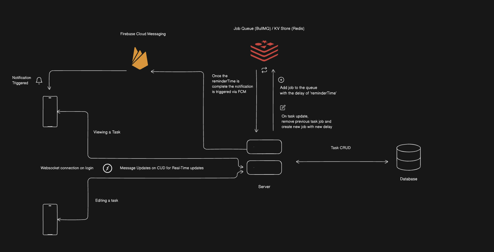

# tasker

A task management system with real time updates and notifications.

## Architecture

## Features

- Authentication - Email/Password and Google OAuth

- Real time updates - Socket.io, Redis PubSub

- Notifications - Firebase Cloud Messaging, BullMQ

## Getting Started

Go to the respective folders for their instructions.

### Server

[Server README](./server/README.md)

### Client

[Client README](./taskermobile/README.md)
